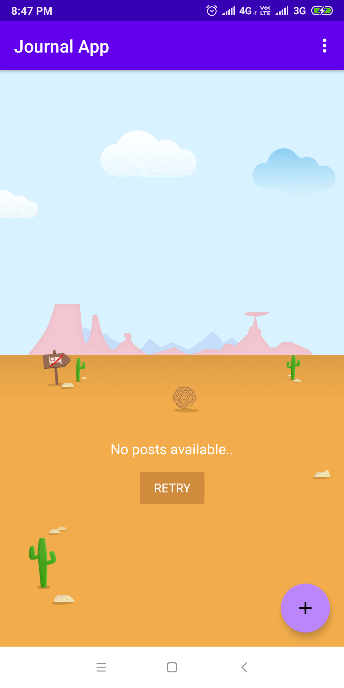
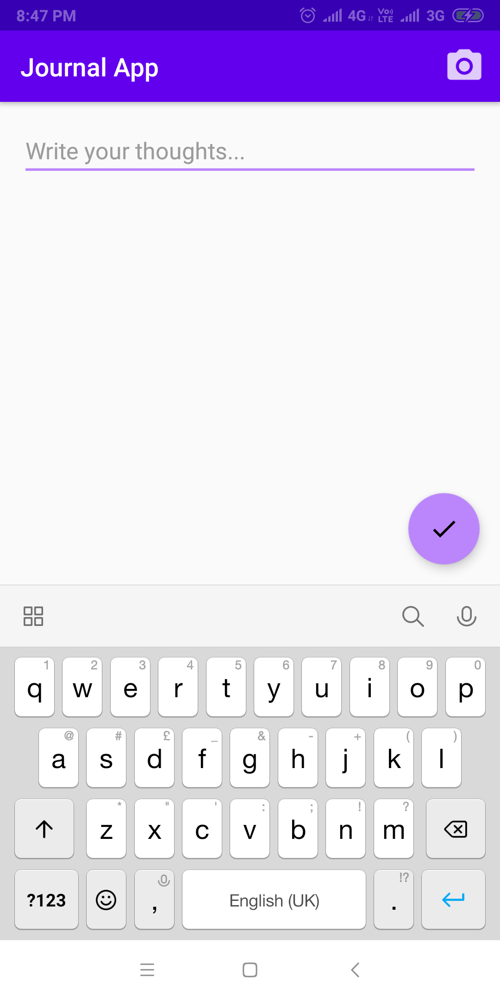
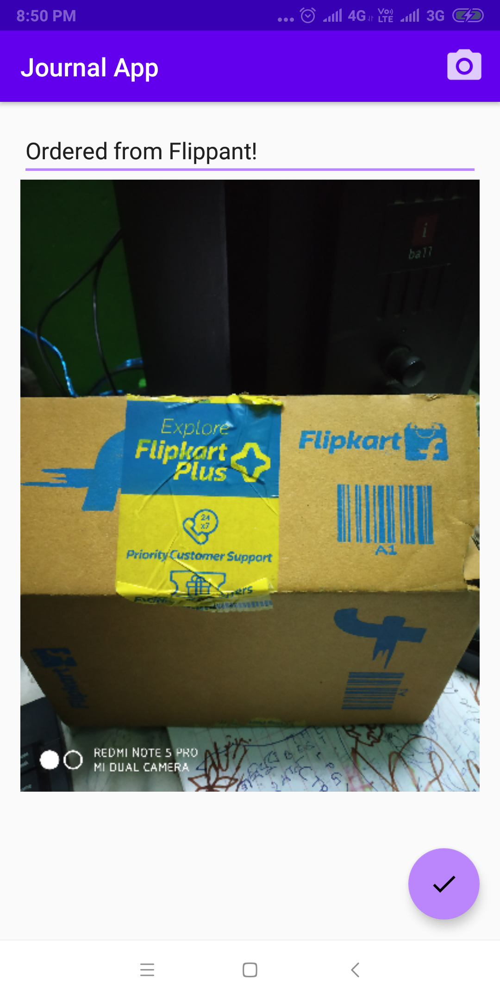
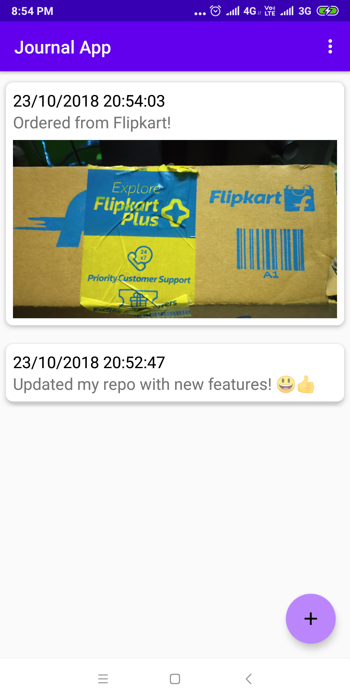

# JournalApp
Journal App using Material Design with Room persistence library

## Screenshots
   
### Download app from
* [Amazon App Store](http://a.co/d/2nxHF9Y) _(Free)_
## Libraries Used
* [Desertplaceholder](https://github.com/JetradarMobile/desertplaceholder)
* [TapTargetView](https://github.com/KeepSafe/TapTargetView)
* [ButterKnife](https://github.com/JakeWharton/butterknife)
* [Android Architecture Components](https://developer.android.com/topic/libraries/architecture/adding-components)
  * [Room](https://developer.android.com/topic/libraries/architecture/room)
  * [ViewModel](https://developer.android.com/topic/libraries/architecture/viewmodel)
  * [LiveData](https://developer.android.com/topic/libraries/architecture/livedata)

## License & Copyright
Licensed under the [MIT Licence](LICENSE)
